# ARTS — System Interaction Flow

The user's journey through the system, from launch to exploring a painting's soundscape.
An **accessibility layer runs throughout**: every state change is announced by voice (or, in
*screen-reader mode*, left to the platform screen reader), and all controls are large,
high-contrast and keyboard-operable.

> Render this file on GitHub, in VS Code (Mermaid extension), or paste the block into

```mermaid
flowchart TD
    Start([User opens ARTS]) --> First{First visit?}
    First -- Yes --> Onb[Onboarding walkthrough<br/>4 steps · Skip / Esc available]
    First -- No --> Home
    Onb --> Home[/Home · Idle<br/>controls + live status/]

    %% ---------- Detection phase ----------
    Home --> Press[[User: press &quot;Procurar quadro&quot;]]
    Press --> Scan[Camera active · scanning<br/>periodic ping · &quot;À procura de obra&quot;]

    Scan --> Seen{Painting in view?}
    Seen -- No --> Keep[Announce: keep searching] --> Scan
    Seen -- Yes --> Focus[Announce: &quot;Quadro à vista.<br/>Mantenha o dispositivo imóvel&quot;]

    Focus --> Centered{Centered &amp; steady<br/>for ~1s?}
    Centered -- No --> Nudge[Guidance: &quot;aponte mais para a<br/>esquerda / direita / cima / baixo&quot;] --> Centered
    Centered -- Yes --> Capture[Announce: &quot;A capturar a imagem&quot;]

    Capture --> Match{Match in<br/>database?}
    Match -- Yes --> Known[Known painting<br/>+ metadata &amp; context]
    Match -- No --> Unknown[Unknown work<br/>blind visual analysis]

    %% ---------- Generation phase ----------
    Known --> Analyze
    Unknown --> Analyze[Processing · Gemini analysis<br/>&quot;A analisar obra e a compor<br/>paisagem sonora&quot;]
    Analyze --> Gen[Parallel generation<br/>music &#40;muted&#41; · TTS · object SFX]
    Gen --> Intro[Intro narration:<br/>title · artist · year]
    Intro --> Ready[Announce: &quot;A paisagem sonora<br/>está pronta&quot;]
    Ready --> Sound[[Soundscape starts:<br/>music fades in + spatial SFX loop]]

    %% ---------- Experience / exploration ----------
    Sound --> Explore{User explores?<br/>&#40;optional&#41;}
    Explore -- Áudio-descrição --> Desc[Play description<br/>music ducks]
    Explore -- Análise Detalhada --> Anl[Play analysis<br/>music ducks]
    Explore -- Intenção do Autor --> Int[Play author&#39;s intention<br/>music ducks]
    Explore -- Pausar --> Pause[Pause music + narration<br/>resume from position]
    Explore -- Definições --> Settings[Toggle filters ·<br/>screen-reader mode]
    Explore -- Parar / nova obra --> Reset[Stop audio · resume search]

    Desc --> Sound
    Anl --> Sound
    Int --> Sound
    Pause --> Sound
    Settings --> Sound
    Reset --> Scan

    %% ---------- Error path ----------
    Analyze -. failure .-> Err[Error modal ·<br/>&quot;Reiniciar Sistema&quot;]
    Gen -. failure .-> Err
    Err --> Home

    classDef user fill:#2196f3,stroke:#1769aa,color:#fff;
    classDef sys fill:#e8f2fd,stroke:#2196f3,color:#0d1b2a;
    classDef decision fill:#fff4e0,stroke:#ff9800,color:#3a2a00;
    classDef err fill:#fdecea,stroke:#f44336,color:#3a0d0a;
    class Press,Desc,Anl,Int,Pause,Settings,Reset user;
    class Onb,Home,Scan,Keep,Focus,Nudge,Capture,Known,Unknown,Analyze,Gen,Intro,Ready,Sound sys;
    class First,Seen,Centered,Match,Explore decision;
    class Err err;
```

> <https://mermaid.live>.

## Phases at a glance

| Phase | What happens | Key states |
|---|---|---|
| **Onboarding** | First-run 4-step walkthrough (skippable). | `showOnboarding` |
| **Detection** | Camera scans; guides the user to frame and steady the artwork; captures it. | `idle → focusing → need_center_* → centered` |
| **Identification** | The capture is matched against the painting database (or treated as *unknown*). | known / `unknown_*` |
| **Generation** | Gemini analyses the work; music (muted), narration and object SFX are generated in parallel; the intro plays. | `isProcessing` |
| **Reveal** | A "soundscape ready" message plays, then the music fades in with the spatial SFX loop. | soundscape start |
| **Exploration** *(optional)* | The user may play the audio-description, detailed analysis, or author's intention; pause/resume; adjust filters; or stop and search again. | user-driven |

## Notes
- **Unknown works** skip author's intention (not in the database) and use a blind visual analysis.
- **Pause** suspends both the music and any narration and resumes each from where it stopped.
- **Screen-reader mode** suppresses the app's own spoken announcements so a platform screen reader is the only voice; all `aria-label`s remain, so the flow is unchanged for those users.
- The whole detection loop can be **paused to save performance** while audio is playing.
